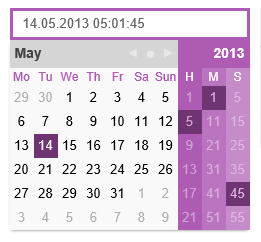

KalEl
=====

A date and time picker in plain JavaScript. No dependecy.



[Watch a Demo here](https://rawgit.com/frogster/KalEl/master/demo/index.html)

## Basic Usage
```JavaScript
var myCal1 = new KalEl(textbox1);
var myCal2 = new KalEl(textbox2, options);
var myCal3 = new KalEl(textbox3, options, callbackTarget);
```

## Options
- **weekStartsOnSun**: *Boolean*, Define first week day. Default is false.
- **value**: *Date*, Maintains the initial selected date.
- **displayValue**: *String*, Maintains the currently displayed date.
- **seconds**: *Boolean*,  Defines if to use seconds or not. Default is false.
- **visibility**: *String['auto', 'manual', 'visible']*,  Defines the visibility behavior. Default is 'auto'.
    - *auto*: KalEl is hidden and opens on element focus, and when the focus is lost
    - *visible*: KalEl is always shown
    - *manual*: Intended for external control with toggle(), show() and hide(). Use hideOnLostFocus to use built in focus loss detection.
- **hideOnLostFocus**: *Boolean*,  Intended to use built in focus loss detection together with manual visibility. If true, KalEl gets hidden in manual visibility mode.. Default is false.
- **wrap**: *Boolean*, Set to false to prevent wrapping the whole control.  
- **labels**: *String[]*, Various labels. Defaults to ['Hour', 'Select Minute', 'Select Second']
- **labelsShort**: *String[]*, Short version of the labels. Defaults to ['H', 'M', 'S']
- **dayNames**: *String[]*, Array of full day names beginning with Sunday.
- **dayNamesShort**: *String[]*, Array of short day names beginning with Sunday. 
- **monthNames**: *String[]*, Array of full month names with January.
- **monthNamesShort**: *String[]*, Array of short month names beginning with January.
- **years**: *Number[]|function*, Array or function that returns an array of available year numbers
- **onDateChanging**: *function(kalEl, oldDate, newDate)*, Called when the date is going to be changed. Return false to prevent the selection of the date.
- **onDateChanged**: *function(kalEl, date)*, Called when the date has changed.
- **parseDateString**: *function(dateString)*, Called to parse a string into a date.
- **formatDate**: *function(date)*, Called to format a date to a string.

## Methods
###select(yearOrDate, month, date, hour, minute, second) 

Sets or manipulates the selected value and triggers a display update. It will also trigger the
onDateChanging and onDateChanged callbacks.

**Parameters**

- **yearOrDate**: Date | Number, Sets or manipulates the selected value and triggers a display update. It will also trigger the
onDateChanging and onDateChanged callbacks.

- **month**: Number, Sets or manipulates the selected value and triggers a display update. It will also trigger the
onDateChanging and onDateChanged callbacks.

- **date**: Number, Sets or manipulates the selected value and triggers a display update. It will also trigger the
onDateChanging and onDateChanged callbacks.

- **hour**: Number, Sets or manipulates the selected value and triggers a display update. It will also trigger the
onDateChanging and onDateChanged callbacks.

- **minute**: Number, Sets or manipulates the selected value and triggers a display update. It will also trigger the
onDateChanging and onDateChanged callbacks.

- **second**: Number, Sets or manipulates the selected value and triggers a display update. It will also trigger the
onDateChanging and onDateChanged callbacks.

### selectNow(date)
Just a shortcut to select the current date.

###display(yearOrDate, month, date, hour, minute, second) 

Sets or manipulates the current display value and triggers a re-rendering of the current month or year.
Used i.e. to display another month or year than the selected.

**Parameters**

- **yearOrDate**: Date | Number, Sets or manipulates the current display value and triggers a re-rendering of the current month or year.
Used i.e. to display another month or year than the selected.

- **month**: Number, Sets or manipulates the current display value and triggers a re-rendering of the current month or year.
Used i.e. to display another month or year than the selected.

- **date**: Number, Sets or manipulates the current display value and triggers a re-rendering of the current month or year.
Used i.e. to display another month or year than the selected.

- **hour**: Number, Sets or manipulates the current display value and triggers a re-rendering of the current month or year.
Used i.e. to display another month or year than the selected.

- **minute**: Number, Sets or manipulates the current display value and triggers a re-rendering of the current month or year.
Used i.e. to display another month or year than the selected.

- **second**: Number, Sets or manipulates the current display value and triggers a re-rendering of the current month or year.
Used i.e. to display another month or year than the selected.

### displayNow(date)
Just a shortcut to display the current date.

### show()
Opens KalEl if the visibility allows it.

### hide()
Hides KalEl if the visibility allows it.

### toggle()
Toggles KalEl.

### toggleMonths()
Toggles the selector for months.

### showMonths()
Shows the selector for months.

### hideMonths()
Hides the selector for months.

### toggleYears(date)
Toggles the selector for years.

### showYears(date)
Shows the selector for months.

### hideYears(date)
Hides the selector for months.

### destroy()
Destroys KalEl.
